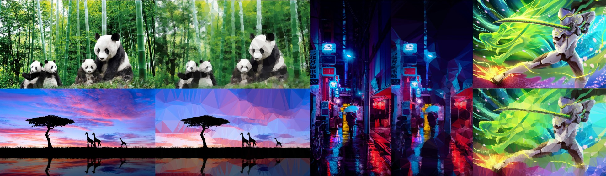
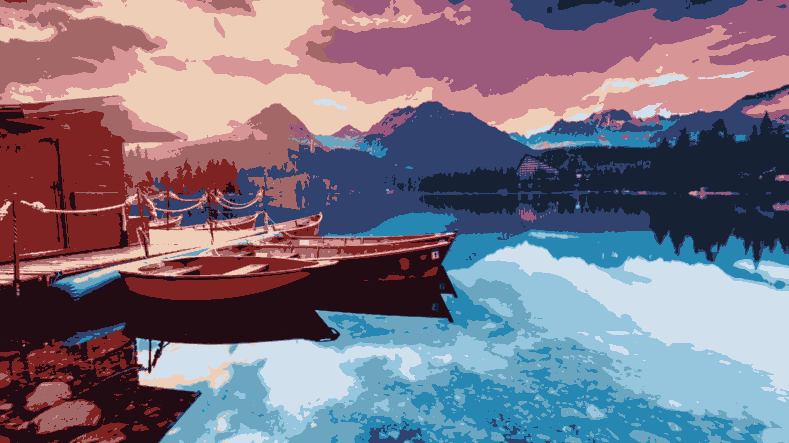
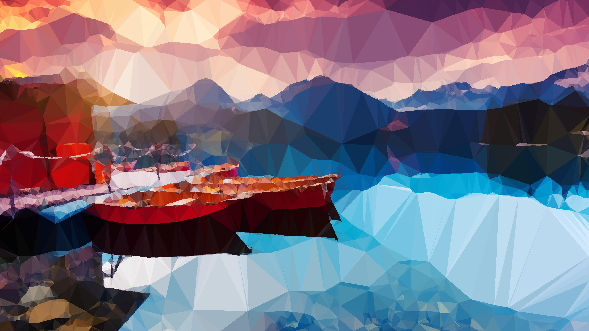

# Polygonization with K-Means
In our project, we try to generate low-poly representations of images with modest computational resources while minimizing the amount of information lost from the original image.

One approach for generating low-poly representations with limited computational power is edge detection followed by triangulation on points selected from the edges. However, basic edge detection only encodes information about the magnitude of difference in color between areas of the image, and will often select superfluous feature points.

We expand on this method by encoding information about the position in the image, the specific color values, and the intensity for each pixel. Using k-means clustering on these features, we hope to achieve better semantic encoding prior to triangulation, thereby minimizing information loss. 

If our method is successful, it will allow everyone--especially artists or indie game developers who may lack the resources to utilize compute-intensive deep learning approaches to image segmentation--access to a tool to generate low-poly mockups of images that better represent the original image compared to mockups generated by simple edge detection followed by triangulation.

Here are some example results:

Methodology:

Step one: We use the color, intensity, position in image, and GLCM contrast, asm, and correlation as 9 values for each pixel. We then use K-Means to cluster these pixels in the corresponding 9-dimensional space. After clustering this way, we color each pixel with their cluster's centroid's color to arrive at an image like this:

Step two: We use Sobel filter edge detection on each of the 9 layers of the K-Means result to find points along the boundaries of clusters to identify relevant edge points to use as vertices. We take the n percentile of edge values where n can be specified by the user. 

Step three: We apply Delaunay triangulation on a random sample of m edge points from the top percentile we obtained in the previous step. After we have created the triangulation, we color each triangle either with the median color or the mean color of each triangle (also up to the user):

Future Work: The texture detection is still work in progress since it is quite slow, calculating the texture for each pixel individually from the matrix of pixels around it. We would also like to experiment with more advanced image segmentation perhaps using a Deep-Learning model as many state-of-the-art segmentation techniques use. Making a front-end aspect would also be great to make our work more accessible to others. Related to this, we are interested in adding functionality where it is possible to decrease detail in user-selected areas to have the triangulation results be more customizable.
